# Active Directory Home Lab

A fully configured Active Directory environment built on VirtualBox, simulating a small enterprise network with centralized identity management, DNS, DHCP, Group Policy, OU-based access control, a departmental file server with NTFS-level permissions, and PowerShell automation for bulk user provisioning.

## Why This Exists

This lab was built to demonstrate hands-on competency with Windows Server administration and Active Directory. Not just theoretical knowledge, but a working environment with documented decisions, real troubleshooting, and automation. Every configuration choice is explained below.

## Architecture

```
┌─────────────────────────────────────────────────────┐
│                   VirtualBox Host                    │
│                                                      │
│  ┌──────────────────┐      ┌──────────────────┐     │
│  │      DC01         │      │    CLIENT01       │     │
│  │  Win Server 2022  │      │   Windows 10      │     │
│  │                   │      │   Enterprise      │     │
│  │  Roles:           │      │                   │     │
│  │  • AD DS (DC)     │      │   Domain-joined   │     │
│  │  • DNS Server     │      │   to mylab.local  │     │
│  │  • DHCP Server    │      │                   │     │
│  │  • File Server    │      │                   │     │
│  │                   │      │                   │     │
│  │  Internal IP:     │      │  Internal IP:     │     │
│  │  192.168.10.1     │      │  192.168.10.10    │     │
│  └────────┬─────────┘      └────────┬─────────┘     │
│           │    Internal Network (intnet)    │         │
│           └────────────────────────────────┘         │
│                    192.168.10.0/24                    │
│                                                      │
│  Both VMs also have NAT adapters for internet access │
└─────────────────────────────────────────────────────┘
```

## Environment Details

| Component | Details |
|-----------|---------|
| Hypervisor | Oracle VirtualBox |
| Domain Controller | Windows Server 2022 Evaluation |
| Client | Windows 10 Enterprise Evaluation |
| Domain Name | `mylab.local` |
| Network | `192.168.10.0/24` (Internal Network) |
| DC IP | `192.168.10.1` |
| Client IP | `192.168.10.10` |
| DHCP Range | `192.168.10.100 – 192.168.10.200` |
| File Server Root | `\\DC01\CompanyShares` |

---

## What's Configured

### Network Configuration

Dual-adapter setup on both VMs: Internal Network for domain traffic, NAT for internet access. The Internal Network adapter on DC01 is configured with a static IP of `192.168.10.1` and DNS pointing to itself (`127.0.0.1`).


### Active Directory Domain Services

- Promoted DC01 as the first domain controller in a new forest (`mylab.local`)
- Forest and domain functional level: Windows Server 2016
- Integrated DNS zone created automatically during promotion

### DNS

- Forward lookup zone: `mylab.local` (AD-integrated)
- DC01 points to itself (`127.0.0.1`) as primary DNS
- Client points to DC01 (`192.168.10.1`) for name resolution — required for domain join and ongoing authentication
- Both DC01 and CLIENT01 have registered Host (A) records in the zone, confirming successful DNS integration


### DHCP

- Scope: `192.168.10.100 – 192.168.10.200`
- Subnet mask: `255.255.255.0`
- Default gateway: `192.168.10.1`
- DNS server: `192.168.10.1`
- DHCP server authorized in Active Directory
- Active address lease for CLIENT01 confirming scope functionality


### Domain Join

CLIENT01 is joined to `mylab.local`, verified in System Properties.

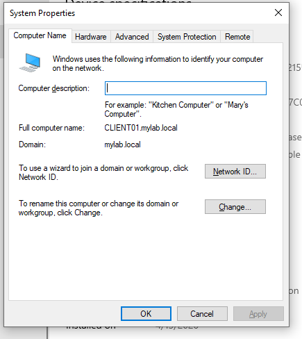

---

## Organizational Structure

### Organizational Units

The domain is organized by department to enable scoped Group Policy application and delegated administration:

- **IT** — IT staff and security group
- **HR** — HR staff and security group
- **Finance** — Finance staff and security group
- **Management** — Management staff and security group
- **Servers** — future server computer accounts
- **Workstations** — client computer accounts
- **Service Accounts** — dedicated accounts for automation and services


### Users and Security Groups

Each department OU contains its users and a matching security group (`IT-Staff`, `HR-Staff`, `Finance-Staff`, `Management-Staff`). Group membership drives both NTFS permissions on the file server and scoped GPO application.

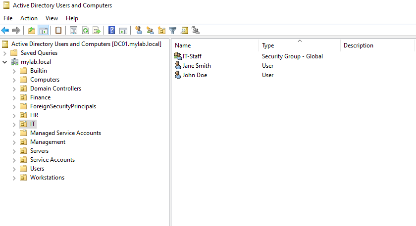

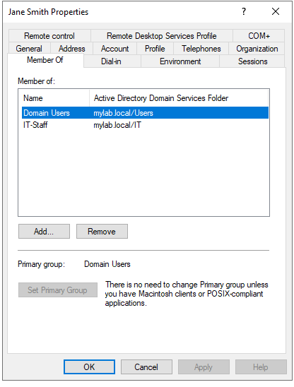

---

## Group Policy

GPOs are linked at the level that matches their scope: domain-wide for universal policies, OU-level for department-specific behaviour.

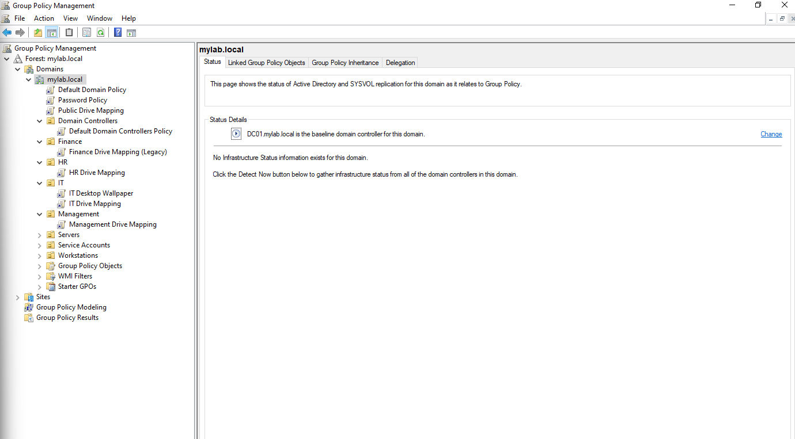

### Domain-Level GPOs

**Password Policy** — enforced across all accounts.

| Setting | Value |
|---------|-------|
| Minimum password length | 10 characters |
| Password complexity | Enabled |
| Password history | 5 passwords remembered |
| Maximum password age | 90 days |
| Minimum password age | 1 day |
| Account lockout threshold | 5 invalid attempts |
| Account lockout duration | 30 minutes |

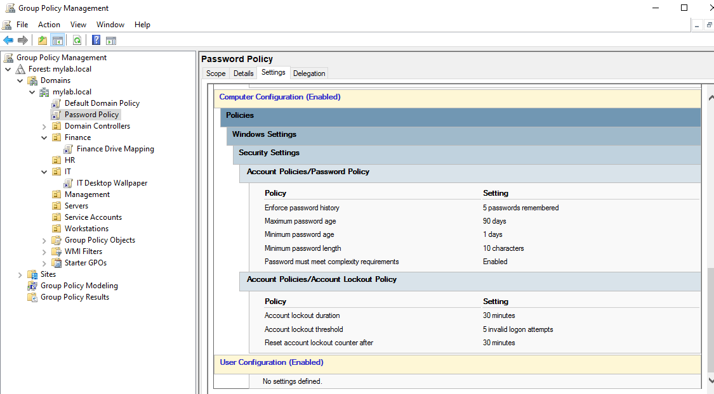

**Public Drive Mapping** — maps `P:` to `\\DC01\CompanyShares\Public` for every domain user, regardless of department.

### OU-Scoped GPOs

| GPO | Linked To | What It Does |
|-----|-----------|--------------|
| IT Desktop Wallpaper | IT OU | Applies a custom desktop wallpaper to IT users via User Configuration → Desktop settings |
| IT Drive Mapping | IT OU | Maps `H:` to `\\DC01\CompanyShares\IT` |
| HR Drive Mapping | HR OU | Maps `H:` to `\\DC01\CompanyShares\HR` |
| Finance Drive Mapping (Legacy) | Finance OU | Maps `F:` to legacy `\\DC01\FinanceData` and `H:` to `\\DC01\CompanyShares\Finance` |
| Management Drive Mapping | Management OU | Maps `H:` to `\\DC01\CompanyShares\Management` |

The `H:` drive letter is reused across all department GPOs but points to a different UNC path per OU — so every user sees a consistent "home department drive" regardless of which department they belong to.

**Custom wallpaper applied via GPO to an IT-scoped user:**


**Finance user's mapped drives (F: legacy and other department drives):**

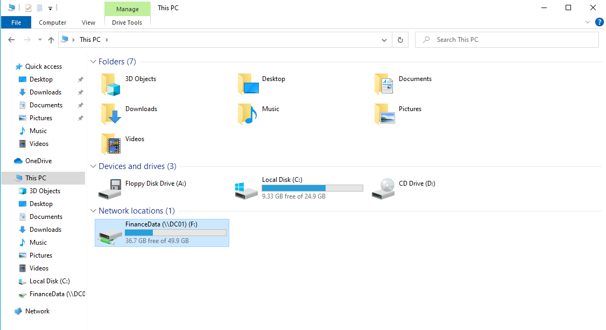

**Policy resolution verified via `gpresult /r`:**

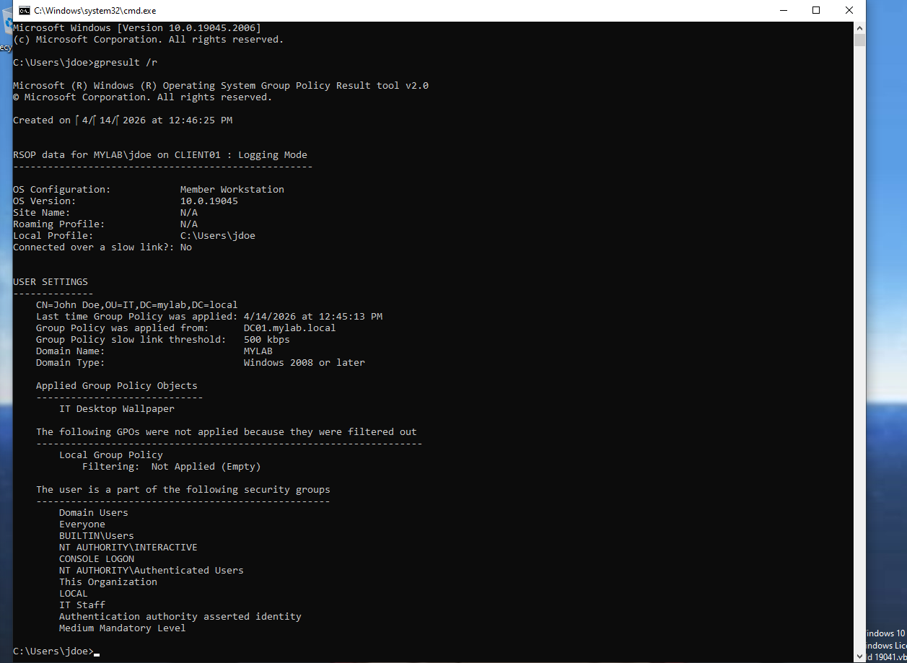

---

## File Server with NTFS Permissions

DC01 hosts `C:\CompanyShares`, shared over the network as `\\DC01\CompanyShares`. The folder contains one subfolder per department plus a `Public` folder accessible to everyone.

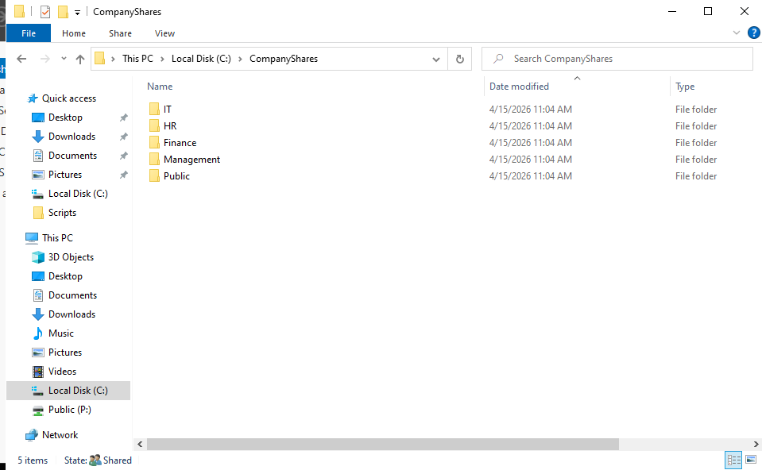

### Share-Level Permissions

The root share is configured with broad read access at the share level. **Domain Users** have **Read** permission — deliberately permissive, because the real access control is enforced at the NTFS layer below.

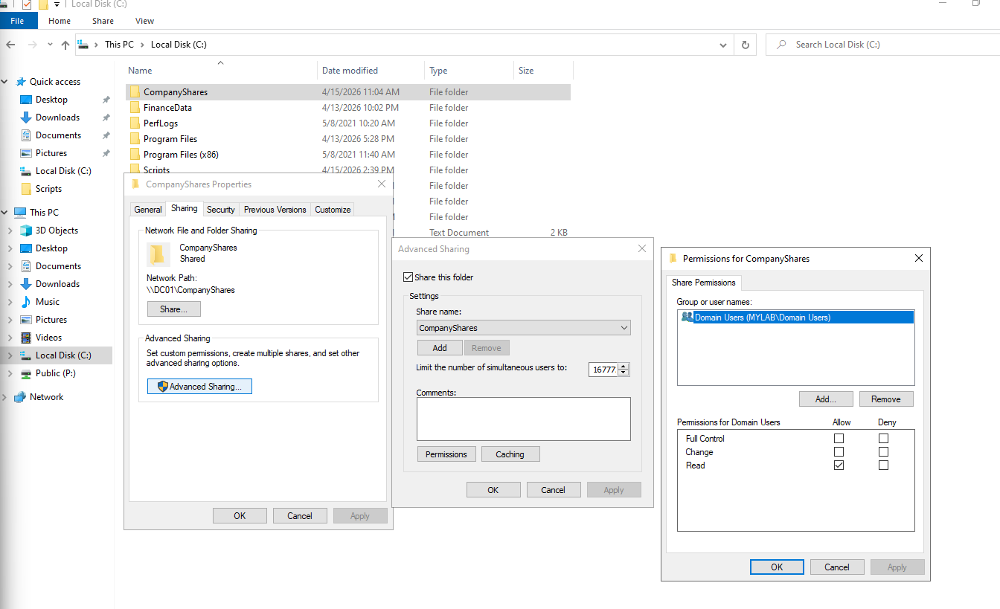

### NTFS Permissions (per department folder)

Inheritance is **disabled** on each department folder, and permissions are explicitly set:

| Principal | Permission | Rationale |
|-----------|------------|-----------|
| `SYSTEM` | Full control | Required for system-level operations |
| `Domain Admins` | Full control | Administrative access |
| `<Department>-Staff` | Modify | Members can read, write, and modify |
| `Management-Staff` | Read & execute | Management can read all departments but not modify |

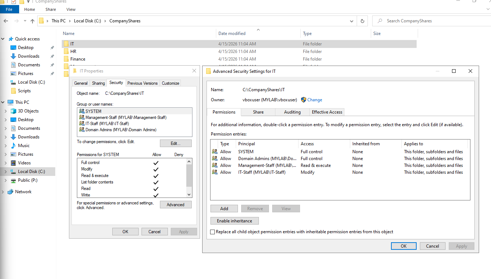

This two-layer design (permissive share, restrictive NTFS) follows the Microsoft-recommended model. Share permissions set an upper ceiling; NTFS enforces real access. It also makes permission auditing simpler — admins only need to reason about one layer.

### Access Control Verification

Logging in as `aturner` (IT-Staff member) on CLIENT01:

- **H: (IT Department)** maps and opens successfully
- **P: (Public)** maps and opens successfully
- Navigating to `\\DC01\CompanyShares\Finance` returns **Access Denied** — NTFS is enforcing the departmental boundary

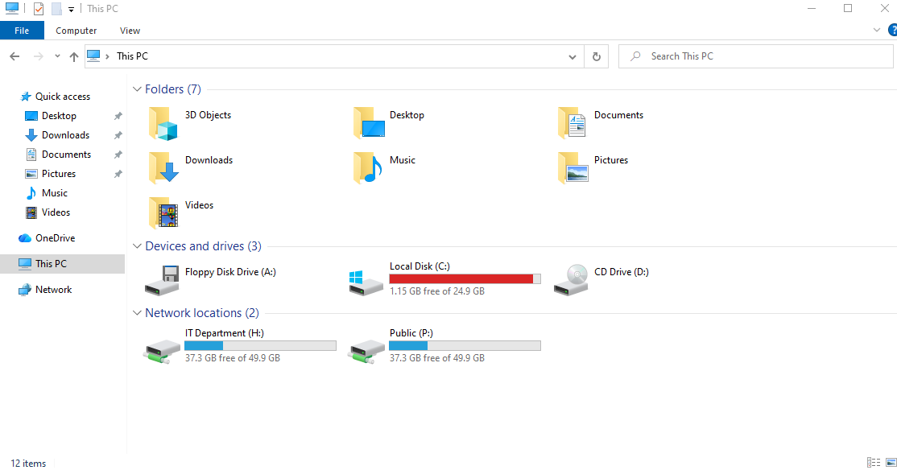

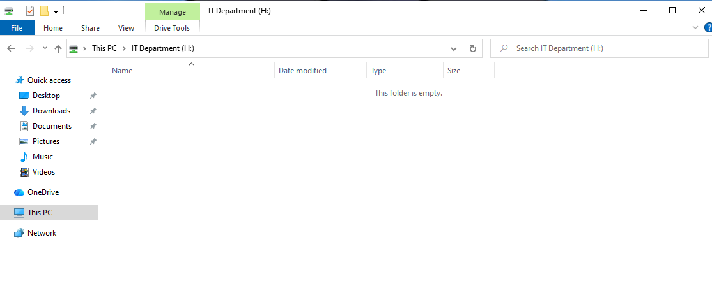

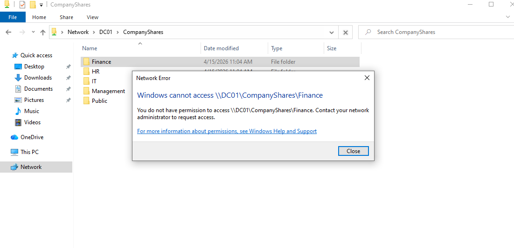

---

## PowerShell Automation — Bulk User Provisioning

Rather than creating users one at a time through the GUI, the `bulk-create-users.ps1` script reads a CSV file and provisions users into the correct OUs and security groups automatically.

### Input

`new-users.csv` — 10 users across 4 departments:

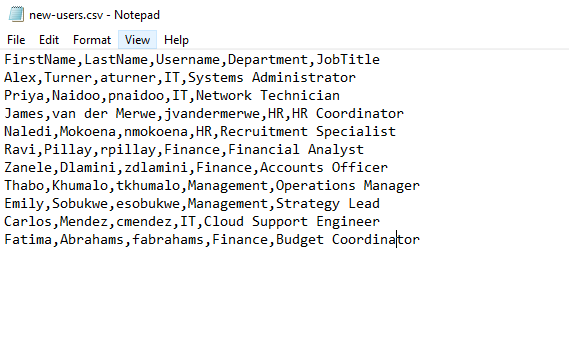

Both script and CSV live in `C:\Scripts` on DC01:

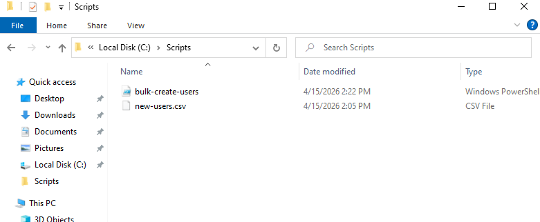

### Script Behaviour

- Reads the CSV row by row
- Creates each user in the OU matching their `Department` column
- Adds each user to the matching `<Department>-Staff` security group
- Tags each created account with `Description = "Created by bulk-create-users.ps1"` (enables safe cleanup without touching manual accounts)
- Writes a timestamped entry for every action to `C:\Scripts\user-creation-log.txt`
- **Idempotent** — re-running skips accounts that already exist rather than failing or duplicating

### Before and After

**Before** — only the original manually created users exist in the OUs:

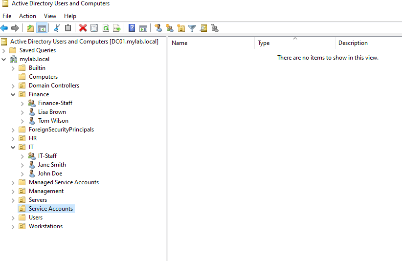

**First run** — 10 accounts created, each placed in the correct OU and group:

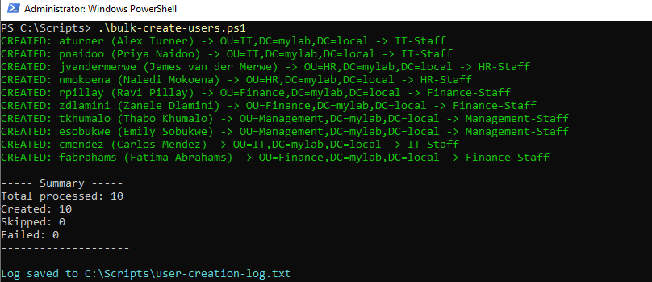

**After** — the IT OU now contains both the original users and the script-created ones (clearly tagged in the Description field):

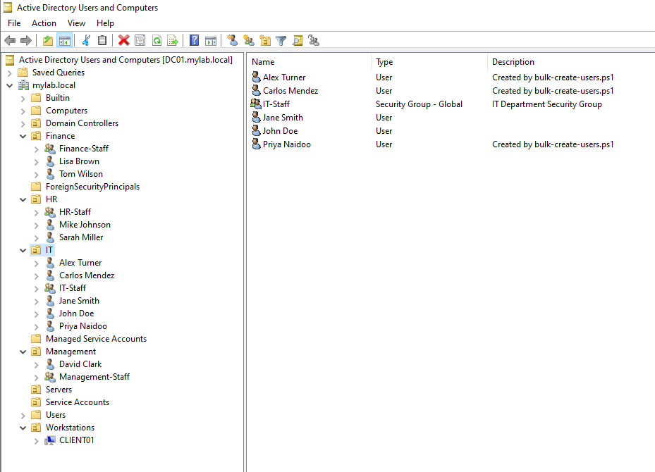

**Idempotency proof** — a second immediate run detects the existing accounts and skips them:

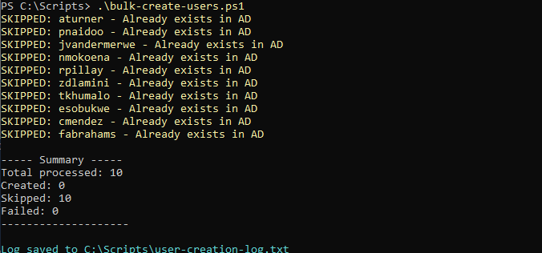

### Auditability

Every run is appended to a log file with timestamps, outcomes, and per-user results — a real audit trail, not just console output:

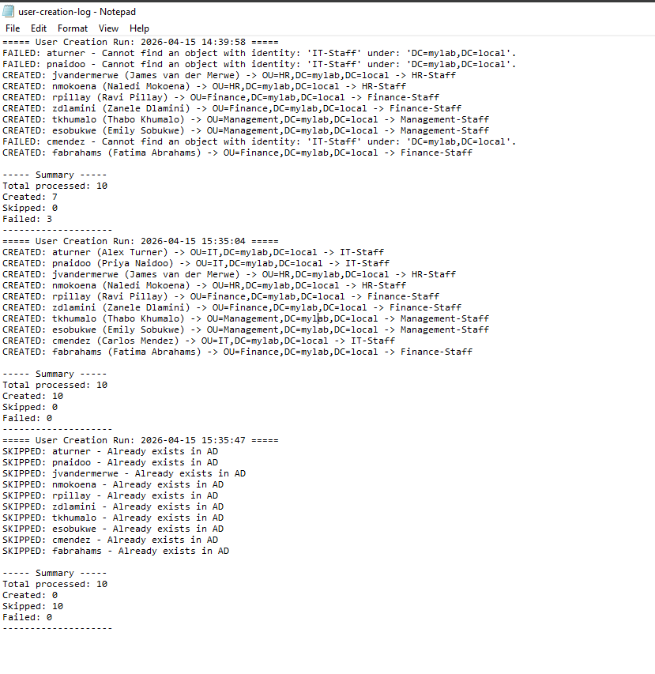

### User Verification

Script-created user properties and group membership:

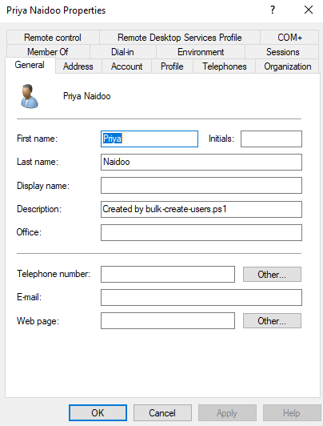

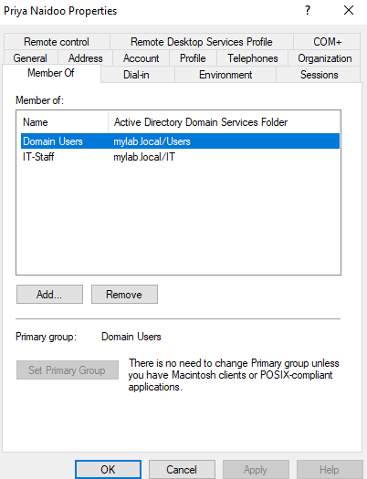

---

## Troubleshooting: The Orphaned SID Incident

Not everything went smoothly, and that's the point of this section. During setup, a problem surfaced that took real debugging to resolve — and that story is more valuable than any perfect screenshot.

### Symptom

After logging into CLIENT01 as `aturner` (a newly script-created IT user), the `P:` (Public) drive mapped correctly, but the `H:` (IT Department) drive did **not** appear. Manually navigating to `\\DC01\CompanyShares\IT` returned **"Windows cannot access... You do not have permission to access"** — despite `aturner` being a confirmed member of `IT-Staff`.

### Diagnosis Steps

1. Ran `gpresult /r` on CLIENT01 — confirmed the `IT Drive Mapping` GPO was applied and `IT-Staff` was in the user's security groups. So Group Policy was reaching the user correctly.
2. Verified from CLIENT01 that the `CompanyShares` root share was still reachable. It was.
3. Pulled the NTFS ACL on the IT folder from DC01:

    ```powershell
    (Get-Acl C:\CompanyShares\IT).Access | Select-Object IdentityReference, FileSystemRights, AccessControlType | Format-Table -AutoSize
    ```

    Found this:

    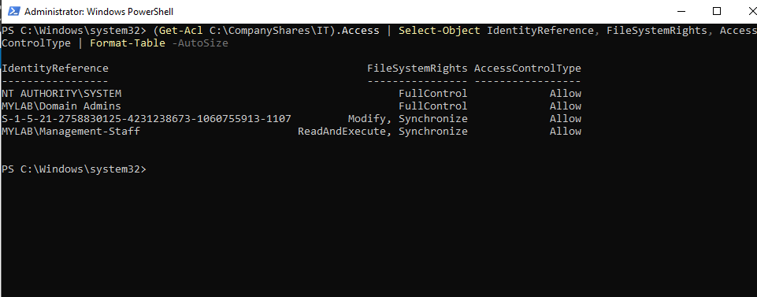

### Root Cause

During initial setup, the `IT-Staff` security group was created through the AD Users and Computers GUI. A non-printable character in the name caused a subtle issue that only surfaced later when PowerShell couldn't resolve the group. The fix at the time was to delete the broken group and recreate it in PowerShell.

That fix worked for AD — but every Windows security identifier is unique. When `IT-Staff` was recreated, the new group got a brand new SID. The NTFS ACL on `C:\CompanyShares\IT` was still pointing at the **old** SID from the deleted group. Since no user in the new `IT-Staff` group matches the old SID, access was denied — even though everything appeared configured correctly at the AD layer.

**Key insight: NTFS ACLs store SIDs, not group names.** Deleting and recreating a group that's already referenced in a filesystem ACL leaves an orphaned SID reference that will silently deny access.

### Fix

Purged the orphaned SID from the ACL and added a fresh entry for the new `IT-Staff` group:

```powershell
$acl = Get-Acl C:\CompanyShares\IT
$orphanedSid = New-Object System.Security.Principal.SecurityIdentifier("S-1-5-21-2758830125-4231238673-1060755913-1107")
$acl.PurgeAccessRules($orphanedSid)
$newRule = New-Object System.Security.AccessControl.FileSystemAccessRule(
    "MYLAB\IT-Staff", "Modify", "ContainerInherit,ObjectInherit", "None", "Allow"
)
$acl.SetAccessRule($newRule)
Set-Acl -Path C:\CompanyShares\IT -AclObject $acl
```

Verified the ACL post-fix:

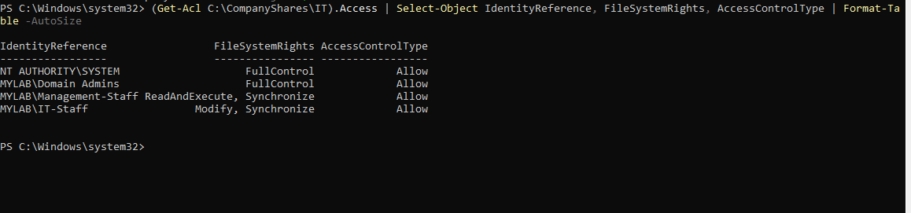

After a fresh logon on CLIENT01, the `H:` drive appeared immediately.

### Lessons

- **Check every layer when something "looks right" but doesn't work.** GPO, share, NTFS, and group membership are four independent layers — any one of them can silently break.
- **Deleting and recreating AD groups has cascading consequences.** Any downstream object that references the old SID (NTFS ACLs, share permissions, GPO security filtering, application access lists) will break silently.
- **`Get-Acl` showing a raw SID instead of a resolved name is always a red flag.** It means the principal was deleted, was never valid, or belongs to a different domain.

---

## Repository Structure

```
ad-lab/
├── README.md                          ← you are here
├── scripts/
│   ├── bulk-create-users.ps1          ← bulk user provisioning
│   └── new-users.csv                  ← sample input for the script
└── screenshots/
    ├── version1-ad-lab/               ← base lab configuration (01–12)
    ├── v2before/                      ← pre-automation state (before bulk script ran)
    ├── v2after/                       ← post-automation + file server state
    └── fileserversetup/               ← NTFS and share permission setup
```

---

## Reproducing This Lab

1. Install VirtualBox on your host machine.
2. Download Windows Server 2022 and Windows 10 Enterprise evaluation ISOs from the Microsoft Evaluation Center.
3. Create two VMs: 2 vCPU / 2–4 GB RAM / 30–40 GB disk each.
4. Configure dual network adapters on both: Adapter 1 = Internal Network (`intnet`), Adapter 2 = NAT.
5. Install both operating systems and VirtualBox Guest Additions.
6. Follow the sequence below:
    - Configure DC01's static IP, promote to DC, install DNS/DHCP
    - Create OU structure, security groups, and manual baseline users
    - Build the `CompanyShares` file server and configure NTFS permissions
    - Create GPOs (password policy, drive mappings, wallpaper)
    - Join CLIENT01 to the domain
    - Run `scripts/bulk-create-users.ps1` on DC01 to provision the remaining users

---

## What I Would Add Next

- **Second domain controller** for replication and redundancy
- **Windows Server Backup** scheduled system state backups
- **Windows Firewall rules via GPO** — centralised firewall configuration
- **LAPS (Local Administrator Password Solution)** — automated local admin rotation
- **Active Directory Certificate Services** — internal PKI for LDAPS and cert-based auth
- **Fine-grained password policies** for privileged accounts
- **Event forwarding** to a dedicated collector for centralised auditing

---

## Tools Used

- Oracle VirtualBox
- Windows Server 2022 (Evaluation)
- Windows 10 Enterprise (Evaluation)
- Active Directory Users and Computers
- Group Policy Management Console
- DHCP and DNS consoles
- PowerShell 5.1 (with ActiveDirectory module)
