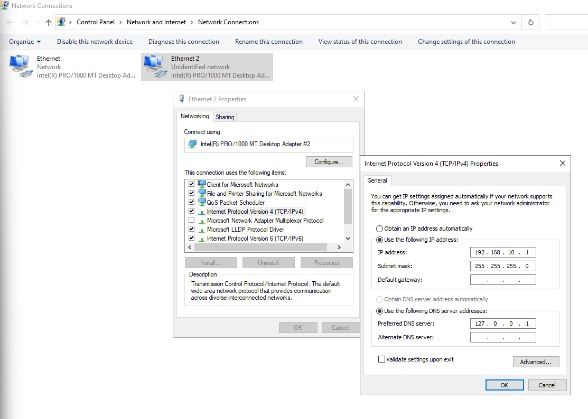
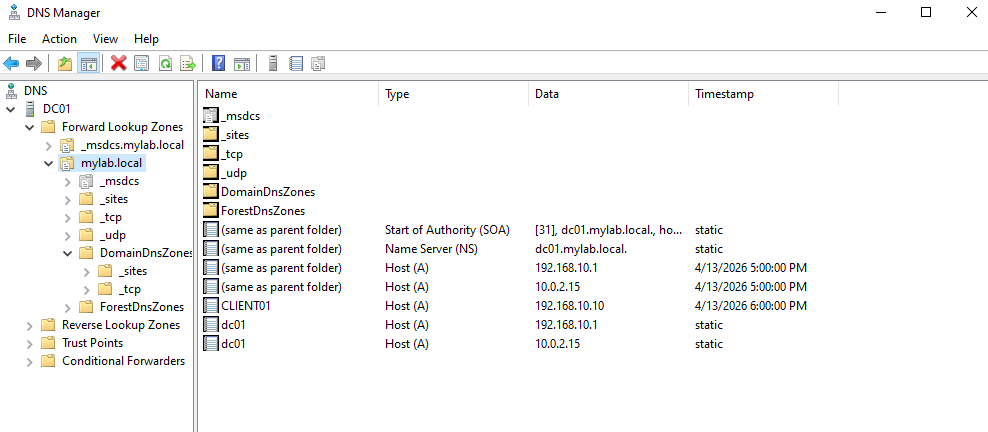
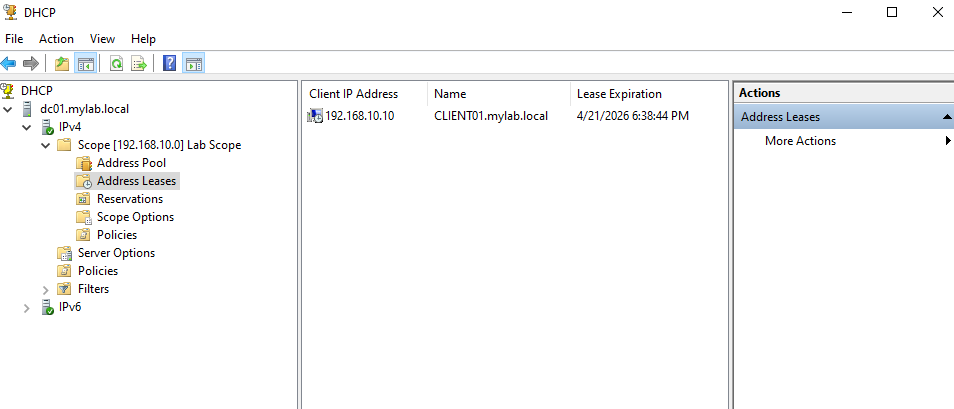
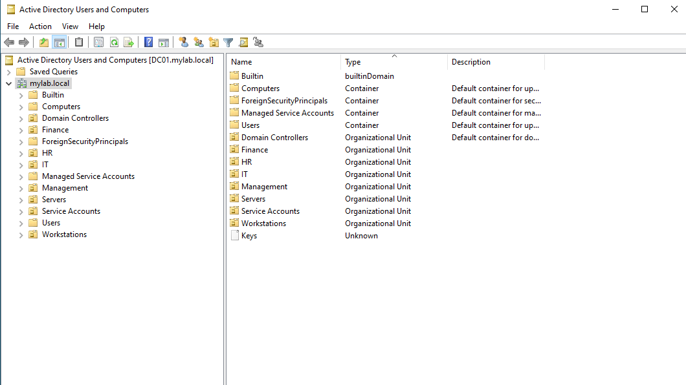
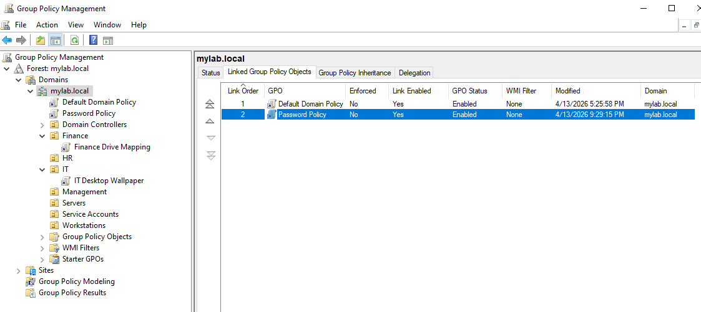
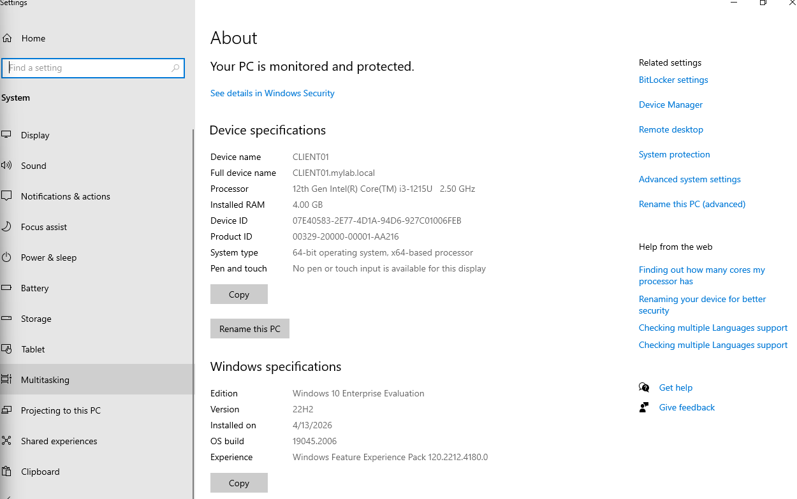

# Active Directory Home Lab

A fully configured Active Directory environment built on VirtualBox, simulating a small enterprise network with centralized identity management, DNS, DHCP, Group Policy, and OU-based access control.

## Why This Exists

This lab was built to demonstrate hands-on competency with Windows Server administration and Active Directory — not just theoretical knowledge, but a working environment with documented decisions. Every configuration choice is explained below.

## Architecture

```
┌─────────────────────────────────────────────────────┐
│                   VirtualBox Host                    │
│                                                      │
│  ┌──────────────────┐      ┌──────────────────┐     │
│  │      DC01         │      │    CLIENT01       │     │
│  │  Win Server 2022  │      │   Windows 10      │     │
│  │                   │      │   Enterprise      │     │
│  │  Roles:           │      │                   │     │
│  │  • AD DS (DC)     │      │   Domain-joined   │     │
│  │  • DNS Server     │      │   to mylab.local  │     │
│  │  • DHCP Server    │      │                   │     │
│  │                   │      │                   │     │
│  │  Internal IP:     │      │  Internal IP:     │     │
│  │  192.168.10.1     │      │  192.168.10.10    │     │
│  └────────┬─────────┘      └────────┬─────────┘     │
│           │    Internal Network (intnet)    │         │
│           └────────────────────────────────┘         │
│                    192.168.10.0/24                    │
│                                                      │
│  Both VMs also have NAT adapters for internet access │
└─────────────────────────────────────────────────────┘
```

## Environment Details

| Component | Details |
|-----------|---------|
| Hypervisor | Oracle VirtualBox |
| Domain Controller | Windows Server 2022 Evaluation |
| Client | Windows 10 Enterprise Evaluation |
| Domain Name | `mylab.local` |
| Network | `192.168.10.0/24` (Internal Network) |
| DC IP | `192.168.10.1` |
| Client IP | `192.168.10.10` |
| DHCP Range | `192.168.10.100 – 192.168.10.200` |

## What's Configured

### Network Configuration

Dual-adapter setup on both VMs: Internal Network for domain traffic, NAT for internet access.



### Active Directory Domain Services

- Promoted DC01 as the first domain controller in a new forest (`mylab.local`)
- Forest and domain functional level: Windows Server 2016
- Integrated DNS zone created automatically during promotion

### DNS

- Forward lookup zone: `mylab.local` (AD-integrated)
- DC01 points to itself (`127.0.0.1`) as primary DNS
- Client points to DC01 (`192.168.10.1`) for name resolution — this is required for domain join and ongoing authentication



### DHCP

- Scope: `192.168.10.100 – 192.168.10.200`
- Subnet mask: `255.255.255.0`
- Default gateway: `192.168.10.1`
- DNS server: `192.168.10.1`
- DHCP server authorized in Active Directory
- Client uses a static IP outside the DHCP range for lab consistency, but the scope is configured and active for additional machines



### Organizational Unit Structure

```
mylab.local
├── IT
├── HR
├── Finance
├── Management
├── Workstations        ← CLIENT01 moved here from default Computers container
├── Servers
└── Service Accounts
```

**Design rationale:** OUs are structured by department to enable targeted Group Policy application. Separate OUs for Workstations, Servers, and Service Accounts follow Microsoft best practices for separating computer and user objects from service-level accounts.



### Users and Security Groups

| OU | Users | Security Group |
|----|-------|----------------|
| IT | John Doe (`jdoe`), Jane Smith (`jsmith`) | `IT-Staff` (Global, Security) |
| HR | Sarah Miller (`smiller`), Mike Johnson (`mjohnson`) | `HR-Staff` (Global, Security) |
| Finance | Lisa Brown (`lbrown`), Tom Wilson (`twilson`) | `Finance-Staff` (Global, Security) |
| Management | David Clark (`dclark`) | `Management-Staff` (Global, Security) |

All users are members of their respective department security groups. Groups are scoped as Global Security groups to allow use in access control and future cross-domain trust scenarios.


### Group Policy Objects

Three GPOs configured to demonstrate domain-wide policy, OU-level targeting, and preference-based configuration:

**1. Password Policy** — Linked to `mylab.local` (domain-wide)

| Setting | Value | Why |
|---------|-------|-----|
| Minimum password length | 10 characters | Exceeds the common 8-character minimum; balances security with usability |
| Complexity requirements | Enabled | Requires uppercase, lowercase, digit, and special character |
| Maximum password age | 90 days | Standard enterprise rotation period |
| Minimum password age | 1 day | Prevents users from cycling through history to reuse passwords |
| Password history | 5 passwords | Blocks reuse of recent passwords |
| Account lockout threshold | 5 attempts | Mitigates brute-force attacks without locking out typo-prone users too aggressively |
| Lockout duration | 30 minutes | Auto-unlocks; reduces helpdesk load |
| Lockout counter reset | 30 minutes | Aligns with lockout duration |


**2. IT Desktop Wallpaper** — Linked to `IT` OU only

- Deploys a custom wallpaper via `\\DC01\Shared\Wallpapers\company-wallpaper.jpg`
- Demonstrates OU-scoped policy: only IT users receive this policy
- Uses a network share (UNC path), which is the correct approach for GPO-deployed resources


**3. Finance Drive Mapping** — Linked to `Finance` OU only

- Maps `\\DC01\FinanceData` to `F:` drive using Group Policy Preferences
- Share permissions: `Finance-Staff` group has Read/Change; Everyone removed
- Demonstrates: drive mapping via GPP, NTFS/share permission scoping, OU-level targeting



### Verified Behavior

Evidence that all configurations are working end-to-end on the domain-joined client:

- [x] Client successfully joined to `mylab.local` domain
- [x] Users can log in on CLIENT01 with domain credentials
- [x] Password policy enforced across all domain accounts
- [x] IT users receive custom wallpaper; other departments do not
- [x] Finance users see `F:` drive mapped on login; other departments do not
- [x] `gpupdate /force` propagates changes to client




## Networking Decisions

**Why two adapters per VM?**
The Internal Network adapter handles all domain traffic (DNS, DHCP, authentication, GPO distribution). The NAT adapter provides internet access for Windows updates and tool downloads. In production, a single network with proper routing and firewall rules would replace this setup — the dual-adapter approach is a lab convenience, not an architecture recommendation.

**Why static IPs instead of using DHCP for everything?**
The domain controller must have a static IP because it's the DNS and DHCP server — clients need a predictable address to find it. The client uses a static IP for lab reproducibility, but could use DHCP in a larger environment.

**Why `mylab.local` instead of a real domain?**
The `.local` TLD is standard for isolated lab environments. In production, Microsoft recommends using a subdomain of a publicly owned domain (e.g., `ad.company.com`) to avoid DNS conflicts.

## What I Would Add Next

- **File server with NTFS permissions** — granular folder-level access control per department
- **Windows Server Backup** — scheduled system state backup of the DC
- **Second domain controller** — for redundancy and demonstrating replication
- **Group Policy for Windows Firewall** — centralized firewall rule deployment
- **LAPS (Local Administrator Password Solution)** — automated local admin password rotation
- **Certificate Services (AD CS)** — internal PKI for LDAPS and certificate-based auth

## How to Reproduce

1. Install VirtualBox on your host machine
2. Download Windows Server 2022 and Windows 10 Enterprise evaluation ISOs from Microsoft Evaluation Center
3. Create two VMs with the specs listed above (2 CPUs, 2–4GB RAM each, 30–40GB disk)
4. Configure dual network adapters: Adapter 1 = Internal Network (`intnet`), Adapter 2 = NAT
5. Install both OSes and VirtualBox Guest Additions
6. Follow the configuration steps documented in this README

## Tools Used

- Oracle VirtualBox
- Windows Server 2022 (Evaluation)
- Windows 10 Enterprise (Evaluation)
- Active Directory Users and Computers
- Group Policy Management Console
- DHCP Management Console
- DNS Manager
